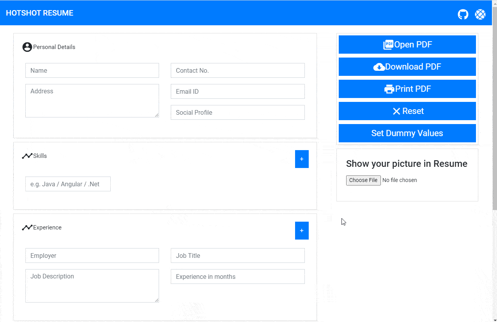

<!-- markdownlint-disable -->
<a href="https://www.richierich25.com" target="_blank">
    
</a>

⚡️ Wow Resume ⚡️
======================

<h4 align="center">
</h4>

<div align="center"> 

  <p align="center">
    <a href="https://github.com/richierich25/wow-resume/blob/main/LICENSE">
      
    </a>
    
    
    <a href="https://github.com/richierich25/wow-resume/issues">
      
    </a>
    <a href="https://github.com/richierich25/wow-resume/releases">
      
    </a>
      <a href="https://github.com/richierich25/wow-resume/stargazers">
      
    </a>
    
  </p>

  <p align="center">
    <a href="#usage">Usage</a> •
    <a href="#configuration">Configuration</a> •
    <a href="#deployment">Deployment</a> •
    <a href="#technology-used">Technology Used</a> •
    <a href="#contributing">Contributing</a> •
    <a href="#contributors">Contributors</a> •
    <a href="#credits">Credits</a>
  </p>
  <br>

  <p>
    The application is powered by Github Actions to automatically push weather notification to a personal telegram bot at specific intervals. It is built on Javascript making use of NodeJS libraries. 
  </p>
  <br>

</div>


<p align="center">
  <a href="">To view this LIVE</a>
</p>


## 📖 Usage


These instructions will get you a copy of the project up and running on your local machine for development and testing purposes.

### Prerequisites

You will need the below installed on your computer
- [Git](https://git-scm.com) _git@2.17.1 or higher_
- [NodeJS](https://nodejs.org/en/download/) (which comes with [npm](http://npmjs.com)) _node@v12 or higher_, _npm@6.9.0 or higher_


### Cloning the repository

```sh
$ git clone https://github.com/richierich25/wow-resume.git
$ cd wow-resume
$ npm i 
```

## 💨 Configuration


## 🖥️ Deployment


## 🛠️ Technology Used

- Angular
- Bootstrap

## 🤝 Contributing

If you wish to **contribute** and make it much better for other developers, please have a look at [Issues](https://github.com/richierich25/wow-resume/issues).

- Add UI for selecting custom City
- Customize the message notification

If you can help us with these. Please don't hesitate to open a [pull request](https://github.com/richierich25/wow-resume/pulls).

We encourage you to contribute. Please check out the [Contributing guide](CONTRIBUTING.md) for guidelines on how to proceed.

## Contributors

<!-- ALL-CONTRIBUTORS-LIST:START - Do not remove or modify this section -->
<table>
  <tr>
    <td align="center"><a href="htts://www.richierich25.com">
    <br /><sub><b>Richard Abraham</b></sub></a></td>
  </tr>
</table>
<!-- ALL-CONTRIBUTORS-LIST:END -->


## 👏🏻 Credits

